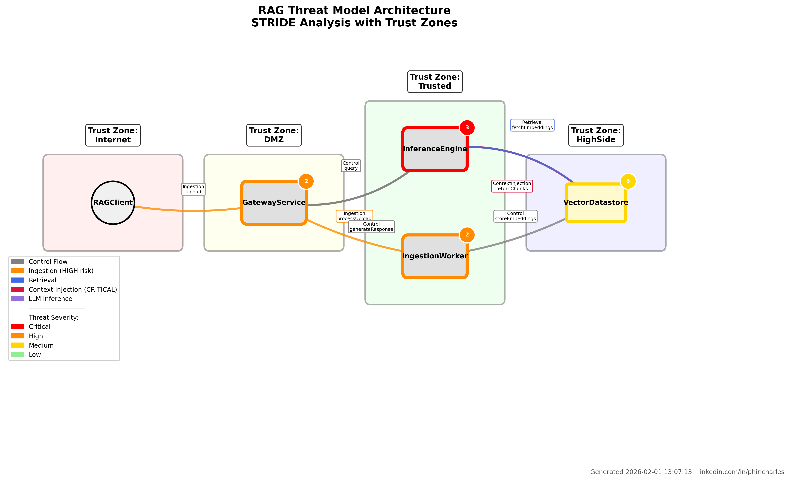
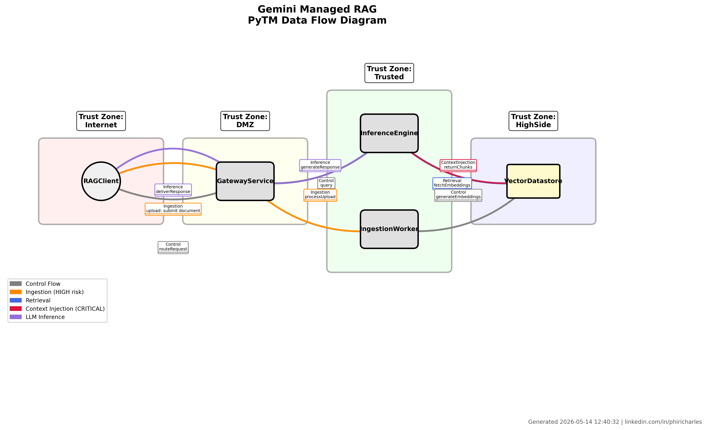

<div class="hero-band" markdown="1">

# Shift-Left Threat Modelling
{: .fs-9 }

Compile a TypeSpec-style architecture into a **STRIDE threat model** with a **mathematically-verified compliance report** — produced deterministically from source, ready for executive, audit, and regulatory review.
{: .fs-5 .fw-300 .hero-tag }

[Get started](#quick-start){: .btn .btn-primary .fs-5 }
[Latest report (HTML)](out/report.html){: .btn .fs-5 }
[View on GitHub](https://github.com/carlchinx/shift-left-threat-modelling){: .btn .fs-5 }

</div>

<div class="badge-row" markdown="1">

[](#)
[](#quick-start)
[](https://github.com/izar/pytm)
[](#quick-start)
[](LICENSE)

</div>

<div class="author-card" markdown="1">

**Author** &nbsp;·&nbsp; Dr. Charles C. Phiri, CITP, Senior IEEE Member, Fellow (ICTAM) &nbsp;·&nbsp; Independent Researcher | ICTAM Fellow
**License** &nbsp;·&nbsp; [MIT](LICENSE) © 2026 Charles C. Phiri

</div>

## Why this exists

<div class="feature-grid" markdown="1">

<div class="feature-card" markdown="1">
<div class="feature-icon">🧩</div>
### TypeSpec → DFD → STRIDE
A single architecture source compiles into a PyTM data-flow diagram **and** a graph-based STRIDE threat model — no manual transcription, no drift.
</div>

<div class="feature-card" markdown="1">
<div class="feature-icon">🔬</div>
### Mathematically verified
The semantic compiler validates output against a formal compliance schema and emits a deterministic [verification.json](out/verification.json) for audit.
</div>

<div class="feature-card" markdown="1">
<div class="feature-icon">📦</div>
### Reproducible artefacts
Every run regenerates the same architecture PNG, DFD PNG, Markdown + HTML reports, and JSON evidence — committed alongside the source.
</div>

</div>

## Architecture at a glance

<div class="two-col" markdown="1">

<figure markdown="1">

<figcaption>Semantic compiler: architecture graph from TypeSpec source.</figcaption>
</figure>

<figure markdown="1">

<figcaption>PyTM: STRIDE-aligned data flow diagram.</figcaption>
</figure>

</div>

<div class="callout" markdown="1">
**Two complementary lenses on one model.** PyTM provides the traditional DFD/STRIDE view familiar to security engineers; the semantic compiler provides a graph-based, formally-verified view familiar to architects and auditors. Both consume the same `architecture_spec.tsp`.
</div>

## Latest report
{: .text-delta }

| Artifact | Format |
|---|---|
| [Threat Modeling Report](out/report.html) | HTML |
| [Threat Modeling Report](out/report.md) | Markdown |
| [Gemini Threat Report](out/gemini_threat_report.md) | Markdown |
| [Verification Results](out/verification.json) | JSON |
| [Architecture Diagram](out/architecture.png) | PNG |
| [PyTM Data Flow Diagram](out/dfd.png) | PNG |
| [Gemini DFD](out/gemini_dfd.png) | PNG |
| [Gemini Sequence (PlantUML source)](out/gemini_sequence.puml) | PUML |

## Background & article

<div class="two-col" markdown="1">

<figure markdown="1">
<iframe src="https://www.linkedin.com/embed/feed/update/urn:li:ugcPost:7426027060369948672?compact=1" height="399" width="504" frameborder="0" allowfullscreen="" title="Embedded post — Explainer"></iframe>
<figcaption><strong>Explainer (short):</strong> <a href="https://www.linkedin.com/feed/update/urn:li:ugcPost:7426027060369948672/">open on LinkedIn</a></figcaption>
</figure>

<figure markdown="1">
<iframe src="https://www.linkedin.com/embed/feed/update/urn:li:ugcPost:7423736867189198848?collapsed=1" height="636" width="504" frameborder="0" allowfullscreen="" title="Embedded post — Main article"></iframe>
<figcaption><strong>Main article:</strong> <a href="https://www.linkedin.com/feed/update/urn:li:ugcPost:7423736867189198848/">open on LinkedIn</a></figcaption>
</figure>

</div>

<div class="callout" markdown="1">
Anonymous viewers may see a sign-in prompt — LinkedIn requires an account to render embedded posts. Use the direct links above as a fallback.
</div>

## Documentation

<div class="feature-grid" markdown="1">

<div class="feature-card" markdown="1">
### Project basics
- [README](README.md)
- [Setup guide](SETUP.md)
- [Project summary](PROJECT_SUMMARY.md)
</div>

<div class="feature-card" markdown="1">
### Methodology
- [Compliance & validation](docs/COMPLIANCE.md)
- [LLM configuration](LLM_CONFIG.md)
- [Standalone visualization](STANDALONE_VISUALIZATION.md)
</div>

<div class="feature-card" markdown="1">
### Notebooks
- [Notebook index](notebooks/)
- [Gemini File Search PyTM threat model](notebooks/gemini_filesearch_pytm_threat_model.ipynb)
</div>

</div>

## Quick Start

```powershell
python -m venv .venv
.\.venv\Scripts\Activate.ps1
python -m pip install -U pip
pip install -r requirements.txt

# 1. Validate compliance between TypeSpec and PyTM specs
python -m threatmodeling.validate

# 2. Run the full pipeline (regenerates everything in out/)
python -m threatmodeling

# 3. Or launch the interactive dashboard
streamlit run app.py
```

## Cite this work

```bibtex
@software{phiri_shift_left_threat_modelling_2026,
  author  = {Phiri, Charles C.},
  title   = {Shift-Left Threat Modelling: PyTM + Semantic Compiler for Managed RAG Architectures},
  year    = {2026},
  url     = {https://github.com/carlchinx/shift-left-threat-modelling},
  license = {MIT}
}
```

## License

This project is licensed under the [MIT License](LICENSE).
Copyright © 2026 **Dr. Charles C. Phiri**, CITP, Senior IEEE Member, Fellow (ICTAM).
